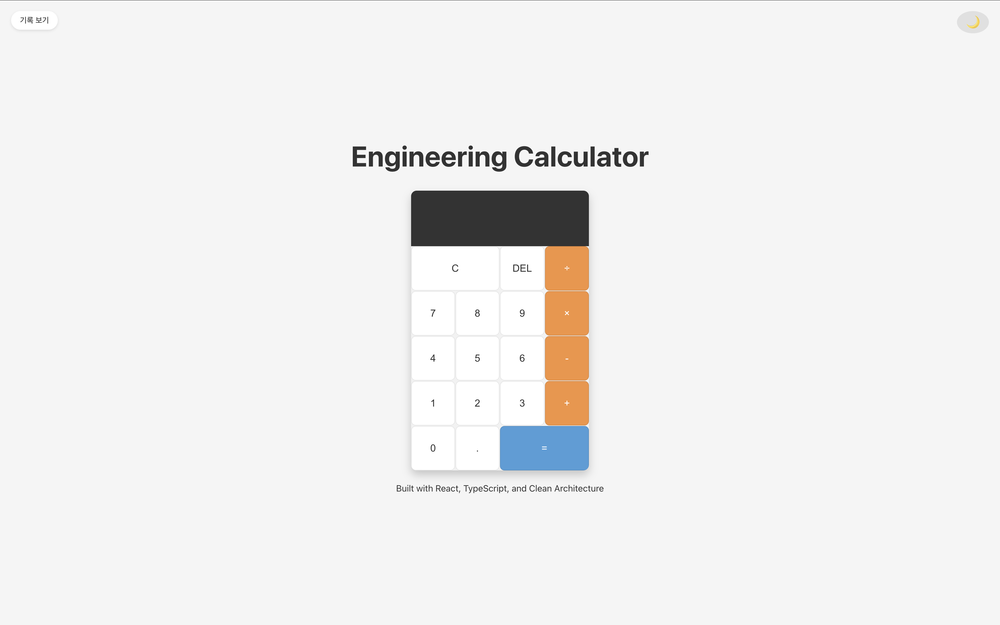

# Engineering Calculator

엔지니어링 계산기는 React, TypeScript, Vite를 사용하여 구축된 현대적인 웹 애플리케이션입니다. 기본 산술 연산, 키보드 입력, 다크/라이트 모드 전환, 계산 기록 기능을 지원합니다.



## 구현된 요구사항

### 기본 기능
- 기본 산술 연산 (덧셈, 뺄셈, 곱셈, 나눗셈)
- 소수점 입력 및 계산
- 결과 표시 및 오류 처리

### 테마 전환 기능
- 다크/라이트 모드 전환 가능
- 시스템 테마 감지 및 자동 적용
- 사용자 선택 테마 로컬 스토리지 저장

### 계산 기록 기능
- 모든 계산 기록 표시
- 개별 기록 항목 삭제 기능
- 전체 기록 초기화 기능
- 로컬 스토리지를 통한 기록 유지

### 키보드 입력 지원
- 숫자 키(0-9) 입력 지원
- 연산자 키(+, -, *, /) 지원
- Enter 키로 계산 실행
- Backspace 키로 삭제 기능
- 키보드 입력 시 시각적 피드백 제공

### UI/UX 개선
- 일관된 크기와 배열의 버튼 레이아웃
- 그리드 레이아웃을 통한 반응형 디자인
- 버튼 클릭 및 키보드 입력 시 시각적 피드백

## 기술 스택

### 프론트엔드 프레임워크
- **React 19**: 컴포넌트 기반 UI 구축
- **TypeScript**: 정적 타입 검사를 통한 코드 안정성 향상
- **Vite**: 빠른 개발 경험을 위한 모던 빌드 도구

### 상태 관리
- **React Context API**: 테마와 계산 기록 상태 관리
- **localStorage**: 사용자 설정 및 계산 기록 유지

### 수학 연산
- **mathjs**: 복잡한 수학 표현식 파싱 및 계산
- **decimal.js**: 정확한 소수점 계산

### 테스팅
- **Jest**: 유닛 테스트 프레임워크
- **@testing-library/react**: 컴포넌트 테스팅

### 아키텍처
- **클린 아키텍처**: 도메인, 애플리케이션, 프레젠테이션 계층 분리
- **CSS 변수**: 테마 관리를 위한 CSS 변수 사용

## 설치 및 실행

```bash
# 저장소 복제
git clone https://github.com/kyunghee-yang/engineering-calculator.git
cd engineering-calculator

# 의존성 설치
npm install

# 개발 서버 실행
npm run dev
```

## 배포 방식

이 프로젝트는 GitHub Pages를 통한 자동 및 수동 배포가 구성되어 있습니다.

### 배포 설정

1. **Vite 구성**
   - `vite.config.ts`에 base URL 설정 추가
   - 프로덕션 환경에서는 `/engineering-calculator/` 경로 사용

2. **GitHub Actions 워크플로우**
   - `.github/workflows/deploy.yml` 파일을 통한 CI/CD 구성
   - main 브랜치에 푸시 시 자동 빌드 및 배포

3. **gh-pages 패키지**
   - 수동 배포를 위한 gh-pages 패키지 사용
   - `npm run deploy` 명령어로 수동 배포 가능

### 자동 배포

`main` 브랜치에 코드를 푸시하면 GitHub Actions가 자동으로 빌드하고 GitHub Pages에 배포합니다.

### 수동 배포

다음 명령어를 사용하여 수동으로 배포할 수 있습니다:

```bash
npm run deploy
```

이 명령어는 애플리케이션을 빌드하고 `gh-pages` 브랜치에 배포합니다.

## 개발 및 테스팅

### 개발 서버 실행

```bash
npm run dev
```

### 빌드

```bash
npm run build
```

### 테스트 실행

```bash
npm run test
```

### 린팅

```bash
npm run lint
```

## 기여 방법

1. 이 저장소를 포크하세요
2. 기능 브랜치를 생성하세요 (`git checkout -b feature/amazing-feature`)
3. 변경사항을 커밋하세요 (`git commit -m 'Add some amazing feature'`)
4. 브랜치에 푸시하세요 (`git push origin feature/amazing-feature`)
5. Pull Request를 제출하세요

## 라이센스

MIT 라이센스에 따라 배포됩니다. 자세한 내용은 [LICENSE](LICENSE) 파일을 참조하세요.
